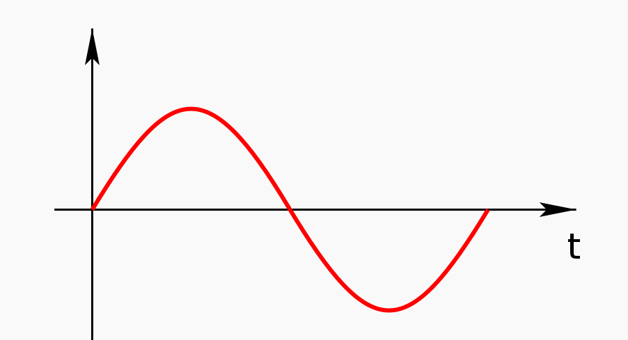
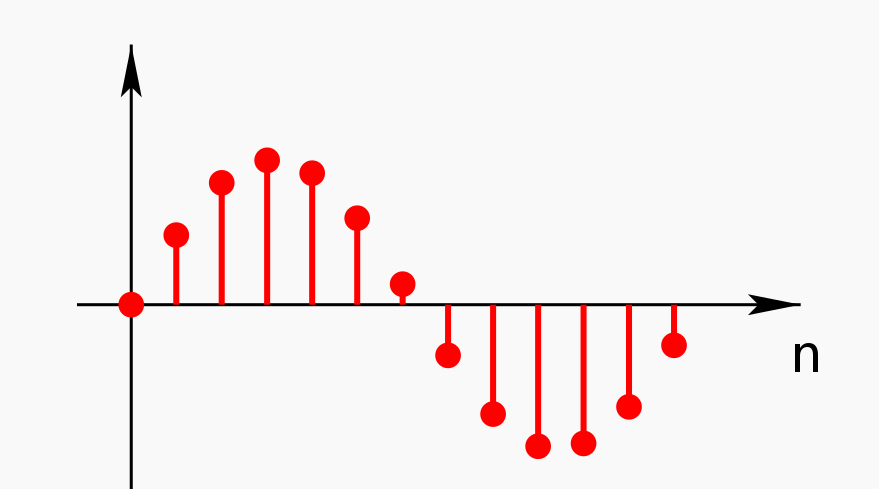
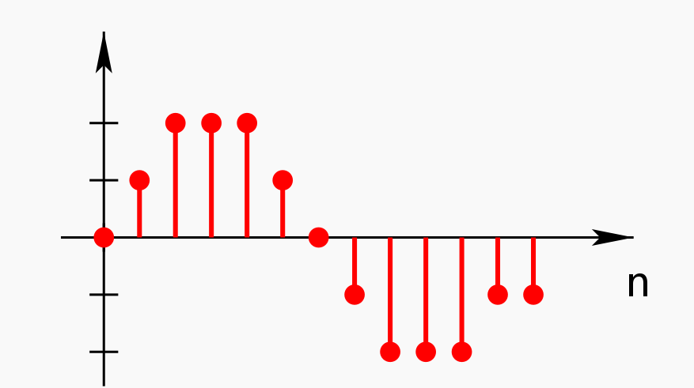

# Цифровой звук

В современном мире цифровая обработка сигналов почти повсеместно вытеснила аналоговую. Исключением не стала и отрасль, относящаяся к записи, хранению и воспроизведению звука. С точки зрения обычного пользователя ещё 20 лет назад были повсеместно распространены аналоговые кассетные проигрыватели, которым на смену пришли уже цифровые CD-диски, затем MP3, а затем, вместе с развитием сети интернет, и стриминговые сервисы.


Чем же отличается цифровой сигнал от аналогового?

- Цифровой сигнал дискретен. То есть, в отличие от непрерывного аналогового сигнала, цифровой существует только в те моменты времени, в которые было произведено аналого-цифровое преобразование. Примеры аналогового и дискретного сигналов показан на рисунке ниже.





- Шкала уровня цифрового сигнала квантованная. В то время, как уровень аналогового сигнала может быть любым (например, 0.1232135346546754775474(5) Вольт), то цифровой сигнал может принимать только уровни, определенные его разрядностью. Если мы используем разрядность цифрового сигнала в 2 бита, то он сможет иметь уровни 0, 1, 2 и 3. Окончательный вид цифрового сигнала показан на рисунке ниже.



Оцифровкой аналогового сигнала называется сочетание двух процессов -- дискретизации и квантования.

Частотой дискретизации цифрового сигнала называется частота, с которой была произведена дискретизация сигнала при аналого-цифровом преобразовании.

Теорема Котельникова (в англоязычной литературе — теорема Найквиста — Шеннона) гласит, что для того, чтобы оцифровать сигнал с максимальной частотой в спектре $f$, необходимо использовать частоту дискретизации $F_s$ как минимум в 2 раза большую, чем частоту $f$.

$$ F_s > 2*f $$

Рассчитаем необходимую частоту дискретизации для человеческого уха.
Слух человека способен воспринимать диапазон частот от 20 Гц до 20 кГц.
Согласно теореме Котельникова (Найквиста -- Шеннона) для оцифровки воспринимаемого человека звуком необходима частота выше, чем 40 кГц. Стандартной частотой для оцифровки звука считается частота 44.1 кГц, использующаяся в Audio CD.


## Синтез цифрового звука

Цифровой звук может не всегда представлять из себя ранее записанный аналоговый сигнал.
Как и любой цифровой сигнал, звук можно синтезировать.
Такая техника повсеместно использовалась в ранних восьмибитных игровых приставках по простой причине -- памяти таких приставок не хватило бы на то, чтобы хранить даже несколько секунд оцифрованного звука.

Рассмотрим техники простейшего синтеза звука на примере игровой приставки Nintendo Entertainment System (NES, Famicom, в странах СНГ известна как Dendy).

Звуковой чип этой приставки содержал суммарно 5 каналов для генерации звука:

 - Два частотных канала с прямоугольной формой сигнала, с переменной скважностью (12.5%, 25%, 50%, 75%), 16 уровнями громкости и диапазоном частот от 54 Гц до 28 кГц.
 - Один частотный канал с треугольной формой сигнала, с фиксированной громкостью, поддерживающий частоты от 27 Гц до 56 кГц.
 - 1 канал белого шума, с 16-ю уровнями громкости, поддерживающий два режима на 16-и заранее запрограммированных частотах.
 - 1 канал цифро-аналогового-преобразователя (ЦАП) с разрядностью в 6 бит, позволяющий воспроизводить короткие фрагменты оцифрованного звука (например, ударные инструменты).


В рамках данной лабораторной работы мы познакомимся с генератором прямоугольной формы сигнала.

## Прямоугольная форма сигнала

Самой простейшей формой звукового сигнала является прямоугольная. Прямоугольный сигнал имеет всего 2 уровня -- высокий и низкий.


Скважностью (Duty cycle) прямоугольного импульса называют отношение периода сигнала $T$ к длительности импульса $\tau$. Применительно ко звуку, скважность прямоугольного сигнала влияет его характер звучания.

$$ S = \frac{T}{\tau} $$


Опишем входные и выходные порты модуля генерации прямоугольного сигнала.

```verilog
module square_code (
  input  logic clk,
  input  logic rst,

  input  logic        enable,
  input  logic [20:0] half_period,
  input  logic [15:0] volume,

  output logic [15:0] square_wave
);
```


 - Сигнал *enable* управляет генерацией сигнала, позволяет включать и выключать её тогда, когда это нужно.
 - Сигнал *half_period* предназначен для управления частотой прямоугольного сигнала. Задаёт полупериод сигнала в тактах clk. Частота прямоугольного сигнала $f$ вычисляется по формуле:
	$$ f = \frac{F_{clk}}{2* (\textit{half\_period} + 1)} $$
 - Сигнал *volume* задаёт уровень (громкость) выходного прямоугольного сигнала.


Внутренняя логика модуля генерации прямоугольного сигнала основана на простом счётчике. По достижении значения *half_period* счётчик обнуляется. Счётчик работает только при наличии сигнала *enable*.

```verilog
logic [20:0] counter;

always_ff @(posedge clk or posedge rst) begin
  if(rst)
    counter <= 21'd0;
  else
    if ((counter >= half_period) || ~enable)
      counter <= 21'd0;
    else
      counter <= counter + 1;
end
```


Для хранения непосредственно генерируемой прямоугольной волны добавим одноразрядный регистр square.
При достижении счётчиком значения *half_period* регистр square инвертируется. Таким образом, формируется прямоугольный сигнал с полупериодом *half_period*.

```verilog
logic square;

always_ff @(posedge clk or posedge rst) begin
  if(rst) begin
    square  <= 1'b0;
  end else if (enable) begin
    if (counter >= half_period)
      square <= ~square;
  end
end
```


Сформируем выходной сигнал модуля. В случае, если сигналы square и *enable* имеют активный уровень, на выход подаётся значение громкости. В противном случае -- нуль.


```verilog
assign square_wave = (square && enable) ? volume
                                        : 16'd0;
```


Ниже приведён полный код модуля.

```verilog
module square_code (
  input  logic clk,
  input  logic rst,

  input  logic        enable,
  input  logic [20:0] half_period,
  input  logic [15:0] volume,

  output logic [15:0] square_wave
);

logic [20:0] counter;

always_ff @(posedge clk or posedge rst) begin
  if(rst)
    counter <= 21'd0;
  else
    if ((counter >= half_period) || ~enable)
      counter <= 21'd0;
    else
      counter <= counter + 1;
end

logic square;

always_ff @(posedge clk or posedge rst) begin
  if(rst) begin
    square  <= 1'b0;
  end else if (enable) begin
    if (counter >= half_period)
      square <= ~square;
  end
end

assign square_wave = (square && enable) ? volume
                                        : 16'd0;

endmodule

```


На рисунке ниже показана временная диаграмма работы модуля.


Представленный дизайн модуля не поддерживает возможность изменения скважности сигнала. Рассмотрим один из способов реализовать данный функционал и сопутствующие изменения логики работы модуля.

Сигнал *half_period* заменяется парой сигналов *full_period* и *active_period*.

- *full_period* обозначает длительность полного периода сигнала (не полупериода, как было ранее) и эквивалентен $T$. Частота сигнала $f$ определяется выражением:
$$ f = \frac{F_{clk}}{\textit{full\_period} + 1} $$ 
- *active_period* устанавливает длительность импульса (время, когда прямоугольный сигнал имеет активный уровень) и эквивалентен $\tau$. Скважность сигнала определяется выражением:
$$ S = \frac{\textit{full\_period} + 1}{\textit{active\_period} + 1} $$


```verilog
module square_duty_cycle (
  input  logic clk,
  input  logic rst,

  input  logic        enable,
  input  logic [20:0] full_period,
  input  logic [20:0] active_period,
  input  logic [15:0] volume,

  output logic [15:0] square_wave
);
```


Verilog-описание счётчика остаётся неизменным, за исключением того, что Сигнал *half_period* заменён на *full_period* и, поскольку счётчику придётся отсчитывать в 2 раза больше значений (полный период вместо половины), его разрядность увеличена на 1 бит.

```verilog
logic [20:0] counter;

always_ff @(posedge clk or posedge rst) begin
  if(rst)
    counter <= 21'd0;
  else
    if ((counter >= full_period) || ~enable)
      counter <= 21'd0;
    else
      counter <= counter + 1;
end
```


Описание генератора импульсов изменилось. Теперь его работа разбивается на две фазы:

 - Фаза, когда значение counter меньше, чем *active_period*. Во время этой фазы значение square выставляется равным единице.
 - Фаза, когда значение counter больше или равно *active\_period*. Во время этой фазы значение square выставляется равным нулю.

```verilog
logic square;

always_ff @(posedge clk or posedge rst) begin
  if(rst) begin
    square  <= 1'b0;
  end else if (enable) begin
    if (counter >= full_period)
      square <= 1'b1;
    else if (counter >= active_period)
      square <= 1'b0;
  end
end
```


На рисунке ниже показана временная диаграмма работы модуля.


Полный код описания генератора прямоугольных импульсов с переменной скважностью представлен ниже.

```verilog
module square_duty_cycle (
  input  logic clk,
  input  logic rst,

  input  logic        enable,
  input  logic [20:0] full_period,
  input  logic [20:0] active_period,
  input  logic [15:0] volume,

  output logic [15:0] square_wave
);

logic [20:0] counter;

always_ff @(posedge clk or posedge rst) begin
  if(rst)
    counter <= 21'd0;
  else
    if ((counter >= full_period) || ~enable)
      counter <= 21'd0;
    else
      counter <= counter + 1;
end

logic square;

always_ff @(posedge clk or posedge rst) begin
  if(rst) begin
    square  <= 1'b0;
  end else if (enable) begin
    if (counter >= full_period)
      square <= 1'b1;
    else if (counter >= active_period)
      square <= 1'b0;
  end
end

assign square_wave = (square && enable) ? volume
                                        : 16'd0;

endmodule

```
