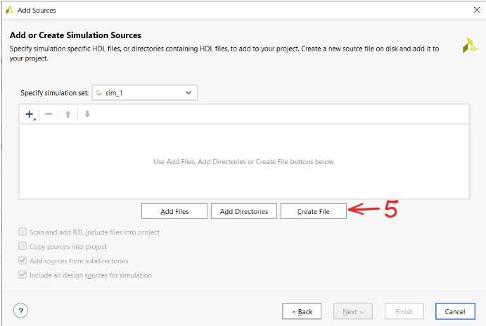
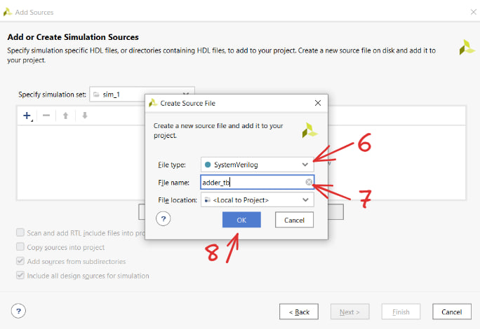
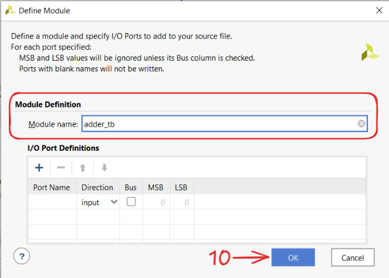
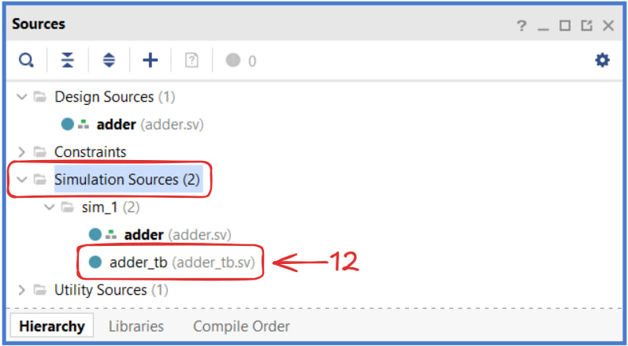
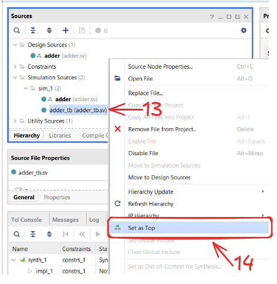

# Тестирование разработанного модуля
Разработка модуля характеризуется не только написанием модуля, описывающего принцип его работы, но и необходимостью доказать его работоспособность.
Работоспособность модуля можно доказать подавая на входы различные значения с последующим получением ожидаемого результата на выходах. В **SystemVerilog** для
базового тестирования модуля используются **тестбенч (testbench)** — это модуль, написанный на SystemVerilog, который не предназначен для синтеза (не превращается в схему). 
Его единственная цель — проверить функциональность синтезируемого модуля (DUT). Данный гайд несет в себе цель научить вас писать простейшие тесты. Проверять работоспособность своего модуля
с помощью тестов гораздо рациональнее хотя бы потому, что вам не приходится ждать по N минут момента, когда сгенерируется битстрим и вы увидите результат на плате. Помимо того, если ваш модуль
отработал неправильно, плата не скажет в каком месте возникла ошибка, а тестбенч (при должном его написании) - скажет.

## Структура гайда
1. [Создание testbench в Vivado](#Создание-testbench-в-Vivado)
2. [Привязка модуля к тестбенчу](#Привязка-модуля-к-тестбенчу)
3. [Запуск симуляции](#Запуск-симуляции)
4. [Initial block](#Initial-block)

## Создание testbench в Vivado
Представим, что у нас есть спроектированный модуль, который необходимо отверифицировать:


Для того, чтобы начать процесс создания тестбенча, необходимо правой кнопкой кликнуть по **Simulation Sources**, а затем кликнуть на **Add Sources...**:


После этого откроется меню, в котором необходимо выбрать **Add or create simulation sources** и затем кликнуть **Next**:


Далее откроется меню _Add or create simulation sources_, в нем выбираем **Create File** в случае, если нужно создать тестбенч, и **Add Files**, если тестбенч уже есть и его нужно просто добавить в проект:



В случае выбора _Create File_, появится меню, в котором необходимо будет указать **File Type** и **File Name**. 
* Тип файла **SystemVerilog**.
* Имя файла можно указывать любым. Однако хорошей практикой считается имя, которое содержит в себе название тестируемого модуля с припиской **_tb**.
* Указав настройки выше, кликаем **OK**.



В окне, выделенном красным, появится информация о созданном/добавленном файле. Убедившись в том, что все необходимое создалось/добавилось, жмем **Finish**.


Появится еще одно окно, в котором кликаем **OK**



В следующем окне кликаем **Yes**


В результате в разделе **Simulation Sources/sim_1** появится созданный тестбенч



Однако только создать его недостаточно, его также необходимо назначить модулем верхнего уровня.
* Правой кнопкой кликаем по тестбенчу
* Выбираем опцию **Set as Top**



После выполнения всех шагов выше, создания модуля для тестирования можно считать завершенным.

## Привязка модуля к тестбенчу
Успешно создав модуль для тестирования, необходимо его привязать к модулю, работоспособность которого требуется проверить. Вы наверняка уже этим занимались, поэтому искренне надеюсь, что данный
процесс ни у кого не вызовет никаких вопросов. Ниже приведен пример привязки:

```verilog
module adder_tb();

logic[31:0] op1;
logic[31:0] op2;

logic[31:0] ans;

adder DUT(
  .a_i ( op1 ),
  .b_i ( op2 ),
  .c_o ( ans )
);
```

Из примера можно выделить следующее:
* В тестбенче **НЕ СОЗДАЮТСЯ** входы и выходы. Создаются только внутренние сигналы, которые затем подвязываются к входам и выходам тестируемого модуля.
* Чтобы полностью проверить работоспособность модуля, для каждого его входа нужно создать сигнал, который будет к нему привязан.
* В целом для выходов тестируемого модуля необязательно создавать сигналы в тестбенче, которые к этим выходам будут привязаны. Информацию о состоянии
выхода все равно можно будет получить. Как ее получить будет рассказано в следующем разделе.

## Запуск симуляции

## Initial block
